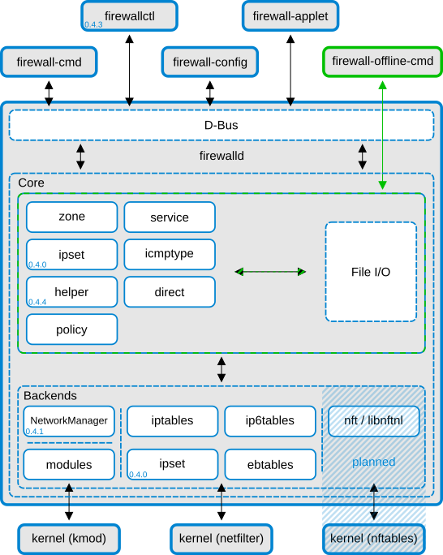
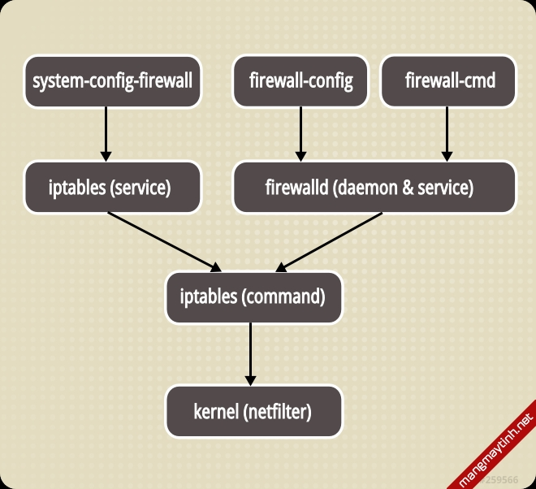

# Tổng quan về Firewalld
---
## Tổng quan
Firewalld cung cấp 1 tường lửa tự động, hỗ trợ network/firewall “zones” được gán với mỗi mức độ tin cậy mạng và kết nối, interface, or source.

Hỗ trợ Ipv4 và ipv6, ethernet brigde, ipset firewall, tách biệt cơ chế run time và permanent.

Cung cấp interface cho các service or application để add iptable, ip6table, và các rule trực tiếp

## Tổng quan kiến trúc
Firewalld được thiết kế thành 2 layer:
- Core layer
- Dbus layer

`Core layer` chịu trách nhiệm xử lý các config và back ends như iptable, ip6table, etables, ipset và các module

`Firewalld Dbus interface` cho phép thay đổi, tạo mới các firewall config.

Các Interface cung cấp:
- Firewall-cmd
- Firewallctl
- Firewall-config
- Firewall-applet
- Firewall-offline-cmd

Các tool trên không tương tác trực tiếp với firewall, mà chúng sửa đổi, tạo mới các rule thông qua `firewalld core` với `IO handlers`.

`firewall-offline-cmd` có thể sử dụng trực tiếp khi firewall đang chạy, các rule sẽ được tạo vĩnh viễn, áp dụng với firewalld sau 5s (Ko khuyến cáo sử dụng)

Firewalld chạy không phụ thuộc vào NetworkManager, nhưng khuyến các tích hợp. Nếu để firwalld chạy độc lập sẽ có nhưng hạn chế sau:
- Không nhận được thông báo từ network devices được đổi tên.
- Nếu firewall khởi tạo sau network setup, connection và interface sẽ nằm ngoài zone đã có.

firewalld cung cấp các hỗ trợ như zones, services, IPSets và ICMP types.
