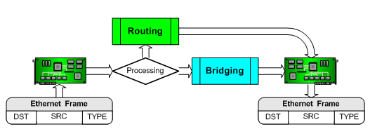
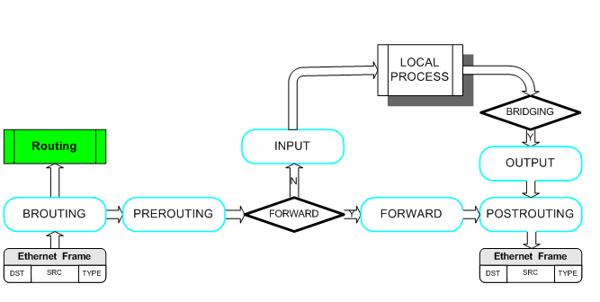
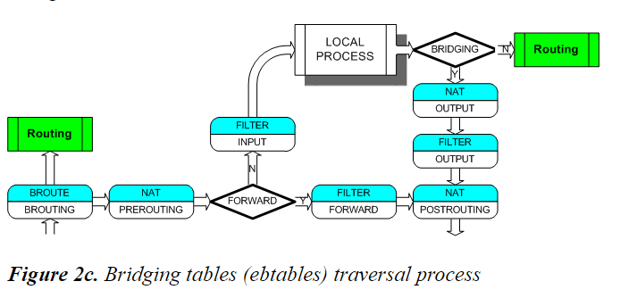
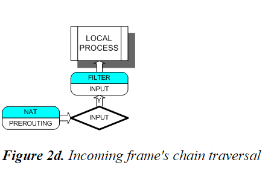
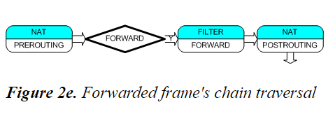
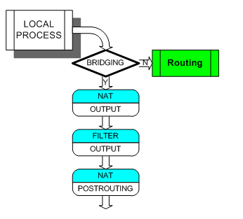
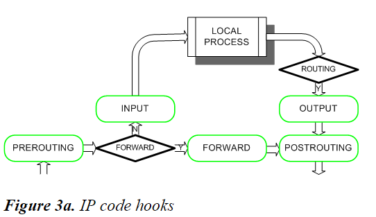
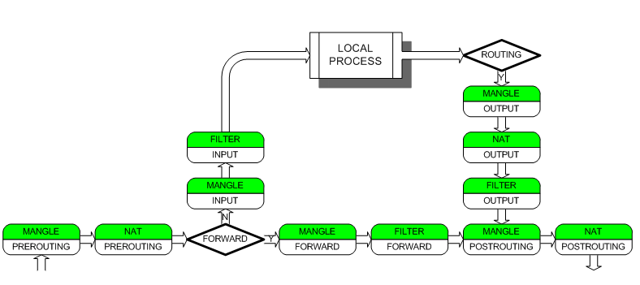
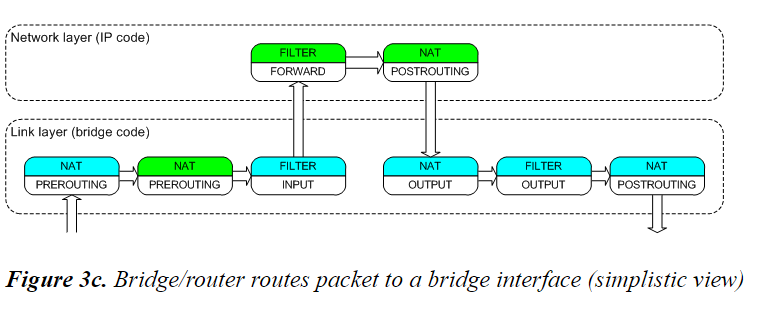
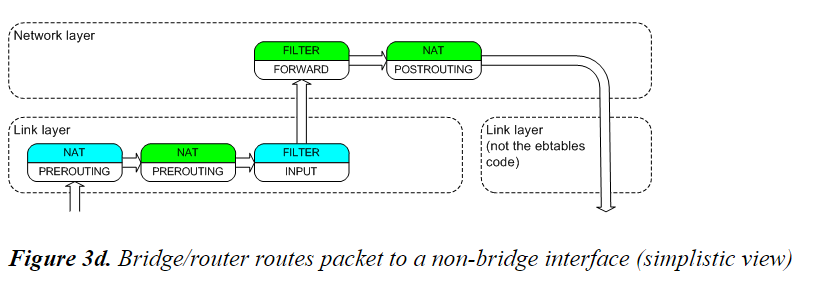

# ebtables/iptables tương tác với Linux-based bridge
---
## Tổng quan
Từ phiên bản kernel 2.6, kernel đã được thêm vào 2 module ebtables và br-nf.

__br-nf code__ khiến bridge IP frames/packet đi qua iptables chains. Ebtables filters nằm trên Ethernet layer, trong khi iptable chỉ filter dựa trên IP packets.

Các giải thích sẽ dựa trên mô hình TCP/IP. 1 số lưu ý của br-nf code sẽ vi phạm mô hình TCP/IP. Đồng thời, khi nói đến IP packet bên trong Link Layer, ta sẽ tham chiếu tới thuật ngữ "frames/packets or packets/frames".

## Cách frames đi qua ebtable chains
__ebtable__ hoạt động trên Ethernet layer, tức OSI tầng 2 (Data link layer) và tầng 1 (Link layer, Network Access layer).

Có 6 mốc được định nghĩa trong Linux bridging code

- Các mốc trên chỉ định những nơi software có thể xứ lý packet/frames tại network code.

VD: Kernel module chịu trách nhiệm xử lý ebtables FORWARD chain sẽ được thêm vào tại bridge FORWARD hook.

> ebtables BROUTING và PREROUTING chains được xử lý trước khi đến quyết định bridging, vì vậy các frame có thể bị từ chối trước khi đến bridge

__Bridge đưa ra quyết định như sau:__
- Brigde frame nếu MAC đích là 1 site bên trong bridge
- Chuyển đến forwarding brigde ports nếu địa chỉ MAC không nằm trong bridge;
- Chuyển đến giao thức cao hơn (IP code) nếu địa chỉ MAC đích là 1 brigde hoặc 1 port của bridge
- Từ chối nếu địa chỉ MAC được đặt cùng side bridge

__Ebtables gồm 3 bảng: filter, nat, broute:__
- broute table sử dụng BROUTING chain
- filter sử dụng FORWARD, INPUT, OUTPUT chains
- nat sử dụng PREROUTING, OUTPUT, POSTROUTING chains

> The filter OUTPUT and nat OUTPUT chains are separated and have a different usage.

Khi NIC nhận 1 frame, frame đầu tiên sẽ tơi BROUTING chain. Tại đây, chain sẽ quyết định định tuyến hoặc bridge frame.

> brouter là thiết bị có khả năng bridge và route

Tiếp theo, frame sẽ truyền tới PREROUTING chain. Tại chain này, ta có thể thay đổi MAC đích của frame (DNAT). Nếu frame được truyền tới chain, briding code sẽ quyết định nơi frame sẽ được truyền đến. Bridge thực hiện bằng cách xem xét địa chỉ MAC đích.

Nếu bridge quyết định frame tới local compute, frame sẽ chuyên tiếp tới INPUT chain. Tại chain, ta có thể lọc frame theo nhưng rule riêng. Sau đó, frame chuyển tiếp tới Network Layer code (ex: IP code).

Bên cạnh đó, frame có thể được chuyền sang side khác của bridge. Nếu vậy, frame sẽ đi thông qua FORWARD chain và tới POSTROUTING chain. Bridged frame có thể được lọc tại FORWARD chain. Tại POSTROUTING chain, ta có thể lọc MAC nguồn (SNAT).

Sau khi frame đi qua bridge, qua nat OUTPUT, filter OUTPUT, nat POSTROUTING chains. nat OUTPUT chain cho phép thay đổi MAC address và filter OUTPUT chain cho phép lọc frames theo các rule set.

> It's also possible for routed frames to go through these three chains when the destination device is a logical bridge device.

## Thiết bị sử dụng như bridge và router (not a brouter)

__IP code hooks scheme:__

__Iptables packet traversal scheme:__

Figures 3a và 3b thể hiện cách iptable chains thêm vào theo IP hook. Khi bridge code và netfilter được tích hợp tại kernel, iptable chain được thêm vào các hook trong briding code.

Khi bridge được sử dụng như router. Ethernet frame(s) bao gồm IP packet sẽ được quyết định bridge dựa theo MAC address

Nếu việc định tuyến truyền packet tới non-bridge interface, sơ đồ:

## Nguồn
http://ebtables.netfilter.org/br_fw_ia/br_fw_ia.html
