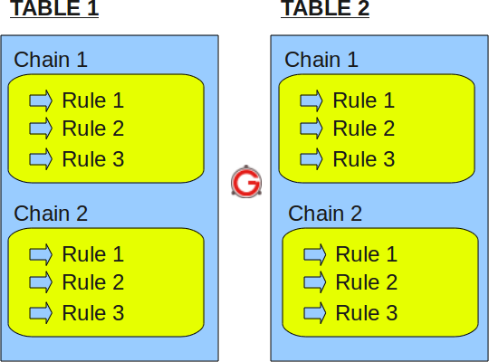
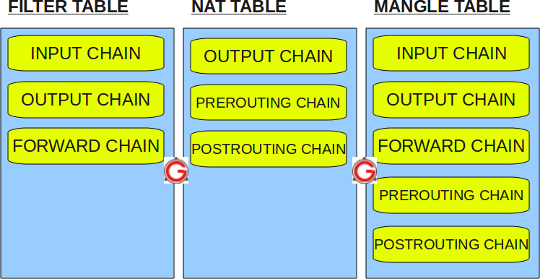

# Kiến trúc iptables
---
## Khái quát
- Iptables được sử dụng để quản lý các gói tin filtering và NAT rules.
- Về tổng quan, iptables có thể chứa nhiều tables, mỗi tables có thể chứa nhiều chains. Mỗi chains có thể chứa nhiều rule. Mỗi rule được định nghĩa cho từng packets.

## Cấu trúc tổng quát
```
iptables -> Tables -> Chains -> Rules
```


> Có thể tóm tắt, tables là 1 chuỗi các chains, chains là 1 chuỗi các firewall rules.

## IPTABLES TABLES và CHAINS
IPTables được xây dựng trên 4 tables.

### Filter Table
Filter table là bảng mặc định của iptables. Vì vậy, nếu bạn không định nghĩa chính xác tables, bạn sẽ sử dụng bảng này. Iptables filter table được xây đựng trên 3 chains

- INPUT chain – xử lý các packet đến host
- OUTPUT chain = xử lý các packet ra khỏi host
- FORWARD chain = xử lý các packet được định tuyến bởi host

### NAT tables
Iptables NAT tables được xây dựng các chains
+ `PREROUTING chain` – thay đổi packets trước khi routing. Packet translation sẽ xảy ra trực tiếp khi packet tới hế thống (trước khi bắt đầu định tuyến). Nó sẽ giúp việc chuyển dịch ip đích của gói phù hợp với việc định tuyến trên host. Sử dụng cho DNAT (destination NAT)
+ `POSTROUTING chain` – thay đổi packets sau khi routing. Packet translation xảy ra khi packet ra khỏi hệ thống. Nó giúp cho việc translate source ip phù hợp với việc định tuyến trên server địch. Nó sử dụng cho Source NAT (source NAT)
+ `OUTPUT chain` – NAT cho locally sinh ra packets trên firewall

### Mangle table
Iptables’s Mangle tables sử dụng cho việc thay đổi gói chuyên dụng. Nó thay đổi QOS bits trong TCP header. Mangle table chứa các chains.

+ PREROUTING chain
+ OUTPUT chain
+ FORWARD chain
+ INPUT chain
+ POSTROUTING chain

### Raw table
Iptables’s Raw table sử dụng cho việc loại trừ các cấu hình. Raw table chứa các chains
+ PREROUTING chain
+ OUTPUT chain



Xem các bảng:
```
# iptables -t filter --list
# iptables -t mangle --list
# iptables -t nat --list
# iptables -t raw --list
# iptables --list = # iptables --list
```

### Target Values
Các action cho rule:
+ ACCEPT – Firewall will accept the packet.
+ DROP – Firewall will drop the packet.
+ QUEUE – Firewall will pass the packet to the userspace.
+ RETURN – Firewall will stop executing the next set of rules in the current chain for this packet. The control will be returned to the calling chain.
