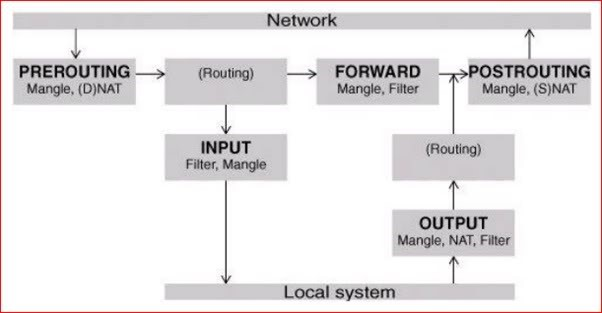
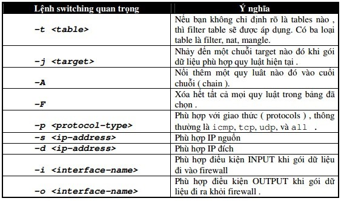

# Tổng quan về Iptables
---
## Giới thiệu
Iptables do Netfilter Organiztion viết ra để tăng tính năng bảo mật trên hệ thống Linux.

Iptables cung cấp những tính năng sau:
-	Tích hợp tốt với Linux kernel, để cải thiện sự tin cậy và tốc độ chạy iptables cũng như đảm bảo ở mức tối thiểu tài nguyên tiêu tốn cần dùng cho việc lọc gọi tin.
-	Quan sát kỹ tất cả các gói dữ liệu. Điều này cho phép firewall theo dõi mỗi một kết nối thông qua nó, và dĩ nhiên là xem xét nội dung của từng luồng dữ liệu để từ đó tiên liệu hành động kế tiếp của các giao thức. Điều này rất quan trọng trong việc hỗ trợ các giao thức FTP, DNS…
-	Việc lọc gói tin dựa trên địa chỉ MAC và các cờ trong TCP header. Điều này giúp ngăn chặn việc tấn công bằng cách sử dụng các gói tin dị dạng (malformed packets) và ngăn chặn việc truy cập từ nội bộ đến một mạng khác bất chấp IP của nó.
-	Ghi chép hệ thống (System logging) cho phép việc điều chỉnh múc độ của báo cáo
-	Hỗ trợ việc tích hợp các trình Web proxy chẳng hạn như Squid.
-	Ngăn chặn hiệu quả các kiểu tấn công từ chối dịch vụ cũng như các hình thức tấn công khác.
-	Cung cấp kỹ thuật NAT linh hoạt
-	Iptables hoàn toàn miễn phí và đi kèm với hầu hết các kernel Linux hiện nay. Đặc biệt mặc dù là sản phẩm miễn phí tuy nhiên Iptables vẫn luôn có 1 đội ngũ hỗ trợ và cộng đồng kỹ thuật rất mạnh có thể hổ trợ các thắc mắc của bạn nếu có sự cố phát sinh trong quá trình sử dụng.

Iptables là một trong những firewall tuyệt vời để gia cố các tầng dưới trong mô hình OSI. Iptables cũng có khả năng hoạt động trên tầng ứng dụng, tuy nhiên nó không được tạo ra để làm điều này, chính vì thế ngoài Iptables chúng ta sẽ sử dụng một firewall khác để gia cố tầng ứng dụng.

## Cơ chế xử lý gói tin trong iptables
> Iptables sẽ kiểm tra tất cả các gói tin khi nó đi qua iptables host, quá trình kiểm tra này được thực hiện một cách tuần tự từ lối vào đầu tiên tới lối vào cuối cùng

### Có ba loại bảng trong iptables:
`Mangle table`: chịu trách nhiệm biến đổi quality of service bits trong TCP header. Thông thường loại table này được ứng dụng trong SOHO (Small Office/Home Office)

`Filter queue`: chịu trách nhiệm thiết lập bộ lọc gói tin (packet filtering), có ba loại built-in chains được mô tả để thực hiện các chính sách về firewall (firewall policy rules)
-	`Forward chain`: Cho phép gói tin ngồn chuyển qua firewall
-	`Input chain`: Cho phép những gói tin đi vào từ firewall
-	`Output chain`: Cho phép những gói tin đi ra từ firewall

`NAT queue`: thực thi chức năng NAT (Network Address Translation), cung cấp hai loại built-in chain sau đây:
- `Pre-routing chain`: NAT từ ngoài vào trong nội bộ. Quá trính NAT sẽ thực hiện trước khi thực thi cơ chế routing. Điều này thuận lợi cho việc đổi địa chỉ đích để địa chỉ trương thích với bảng định tuyến của firewall, khi ta cấu hình ta có thể dùng khóa DNAT để mô tả kỹ thuật này
- P`ost-routing chain`: NAT từ trong ra ngoài. Quá trình NAT sẽ thực hiện sau khi thực hiện cơ chế định tuyến. Nhằm thay đổi địa chỉ nguồn của gói tin. Kỹ thuật này được gọi là NAT 1-1 hoặc many-to-one, Source NAT hay SNAT
- `OUTPUT`: Trong loại này firewall sẽ thực hiện quá trình NAT.

Để có cái nhìn tổng quan về việc lọc và xử lý gói tin trong iptables, chúng ta có thể tham khảo hình sau:




VD:
```
Quá trình lọc và xử lý gói tin trong iptables Đường đi của gói tin trong iptables
Đầu tiên, gói dữ liệu đến mạng A, tiếp đó nó được kiểm tra bởi mangle table PREROUTING chain (nều cần).Tiếp theo là kiểm tra gói dữ liệu bởi nat table’s PREROUTING chain để kiểm tra xem gói dữ liệu có cần DNAT hay không? DNAT sẽ thay đổi địa chỉ đích của gói dữ liệu. Rồi gói dữ liệu được dẫn đi. Nếu gói dữ liệu đi vào một mạng được bảo vệ, thì nó sẽ được lọc bởi FORWARD chain của filter table, và nếu cần gói dữ liệu sẽ được SNAT trong POSTROUTING chain để thay đổi IP nguồn trước khi vào mạng B. Nếu gói dữ liệu được định hướng đi vào trong bên trong firewall, nó sẽ được kiểm tra bởi INPUT chain trong mangle table, và nếu gói dữ liệu qua được các kiểm tra của INPUT chain trong filter table, nó sẽ vào trong các chương trình của server bên trong firewall. Khi firewall cần gởi dữ liệu ra ngoài. Gói dữ liệu sẽ được dẫn và đi qua sự kiểm tra của OUTPUT chain trong mangle table( nếu cần ), tiếp đó là kiểm tra trong OUTPUT chain của nat table để xem DNAT (DNAT sẽ thay đổi địa chỉ đến) có cần hay không và OUTPUT chain của filter table sẽ kiểm tra gói dữ liệu nhằm phát hiện các gói dữ liệu không được phép gởi đi. Cuối cùng trước khi gói dữ liệu được đư ra lại Internet, SNAT and QoS sẽ được kiểm tra trong POSTROUTING chain.
```

### Targets
Target là hành động diễn ra khi một gói dữ liệu được kiểm tra phù hợp với một yêu cầu nào đó. Khi một target đã được nhận dạng, gói dữ liệu cần nhảy (jump) để thực hiện các xử lý tiếp theo. Bảng sau liệt kê các targets mà iptables sử dụng.

__Các targets được sử dụng:__

- ACCEPT: iptables ngừng xử lý gói tin đó và chuyển nó vào một ứng dụng cuối hoặc hệ điều hành để xử lý nó.
- DROP: iptables ngừng xử lý gói tin này và nó bị chặn hoặc loại bỏ.
- LOG: Thông tin của nó sẽ được đưa vào syslog để kiểm tra. Iptables tiếp xúc xử lý gói tiin với quy luật kế tiếp. –log-prefix “string”: Iptables sẽ thêm vào log message một chuổi (string) do người dùng định sẳn. Thông thường để thông báo lý do vì sao gói bị loại bỏ
- REJECT: Tương tự như DROP nhưng nó sẽ trả lại cho phía gửi một thông báo rằng gói đã bị chặn và loại bỏ.
- DNAT: Dùng để thực hiện thay đổi địa chỉ đích của gói dữ liệu. –to-destination ipaddress iptables sẽ viết lại địa chỉ ipaddress vào địa chỉ đích của gói tin,
- SNAT: Thay đổi địa chỉ nguồn của gói dữ liệu.
- MASQUERADE: Dùng để thay đổi địa chỉ ip nguồn. Mặc định thì địa chỉ ip nguồn sẽ giống với ip của firewall.

### Các tham số switching quan trọng của iptables:
> Các tham số sau sẽ cho phép iptables thực hiện các hành động sau cho phù hợp với biều đồ xử lý gói tin do người sử dụng định sẳn.

Các lệnh switching quan trọng:


ví dụ:
```
iptables -A INPUT -s 0/0 -i eth0 -d 10.0.0.1 -p TCP -j ACCEPT
```
> Với lệnh trên sẽ cấu hình cho Iptables cho phép (ACCEPT) các gói tin TCP đến từ card mạng eth0, có địa chỉ nguồn bất kì (0/0) và địa chỉ đích là 10.0.0.1

Tổng hợp các lệnh TCP và UDP thông dụng:
-	`-p tcp –sport <port>`: Phù hợp với port nguồn TCP. Có thể là một giá trị hoặc 1 chuỗi dạng Port-bat-dau:Port-ket-thuc
-	`-p tcp –dport <port>`: Phù hợp với port đích TCP. Có thể là một giá trị hoặc 1 chuỗi dạng Port-bat-dau:Port-ket-thuc
-	`-p tcp -syn`: Dùng để nhận dạng một yêu cầu kết nối TCP mới.
-	`-p udp –sport <port>`: Phù hợp với port nguồn UDP. Có thể là một giá trị hoặc chuỗi dạng Port-bat-dau:Port-ket-thuc
-	`-p udp –dport <port>`: Phù hợp với port đích UDP. Có thể là một giá trị hoặc chuỗi dạng Port-bat-dau:Port-ket-thuc

VD:
```
iptables -A FORWARD -s 0/0 -i eth0 -d 10.0.0.1 -o eth1 -p TCP --sport 999:65535 --dport 80 -j ACCEPT
```
> Với lệnh trên sẽ cấu hình Iptables cho phép firewall chấp nhận các gói tin giao thức TCP đến từ card mạng eth0 có địa chỉ IP bất kì (0/0) và địa chỉ đích là 10.0.0.1 đến card mạng eth1. Số port nguồn từ 999 đến 65535 và port đích là 80 (HTTP).

Một số điều kiện mở rộng thông dụng:

•	`-m multiport –sport <port,port>` : Liệt kê nhiều port nguồn khác nhau của TCP/UDP được phân cách bởi dấu phẩy. Lưu ý đây là liệt kê port chứ không phải chuỗi các port
•	`-m multiport –dport <port,port>` : Liệt kê nhiều port đích khác nhau của TCP/UDP được phân cách bởi dấu phẩy. Lưu ý đây là liệt kê port chứ không phải chuỗi các port
•	`-m multiport –ports <port,port>` : Liệt kê nhiều port khác nhau của TCP/UDP được phân cách bởi dấu phẩy. Lưu ý đây là liệt kê port chứ không phải chuỗi các port. Không phân biệt port nguồn hay đích.
•	`-m state <state>`

Các trạng thái thông dụng nhất được dùng là:
- __ESTABLISHED__: Gói dữ liệu là một phần kết nối đã được 2 bên thiết lập.
- __NEW__: Gói dữ liệu bắt đầu của một liên kết nối mới.
- __RELATED__: Gói tin bắt đầu một kết nối phụ. Thông thường đây là một đặc điểm của các giao thức FTP hoặc lỗi ICMP.
- __INVALID__: Gói tin không thể nhận dạng được. Điều này có thể do việc thiếu tài nguyên hệ thống hay do ICMP không trùng với 1 luồng dữ liệu đã có sẵn.

VD:
```
iptables -A FORWARD -s 0/0 -i eth0 -d 10.0.0.1 -o eth1 -p TCP --sport 1024:65535 -m multiport --dport 80,443 -j ACCEPT

iptables -A FORWARD -d 0/0 -o eth0 -s 10.0.0.1 -i eth1 -p TCP  -m state --state ESTABLISHED -j ACCEPT
```
> Iptables được cấu hình cho phép firewall chấp nhận các gói dữ liệu có giao tiếp (protocols) là TCP, đến từ card mạng eth0, có bất kỳ địa chỉ IP nguồn là bất kỳ, đi đến địa chỉ 10.0.0.1 qua card mạng eth1. Số port nguồn là từ 1024 đến 65535 và port đích là 80 (www/http) và 443 (https). Đến khi các gói dữ liệu nhận trở lại từ 10.0.0.1 cách dùng tham số -m state và –state ESTABLISHED.
